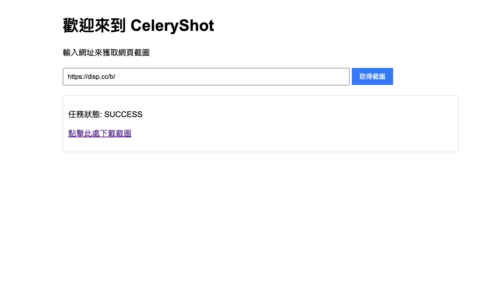
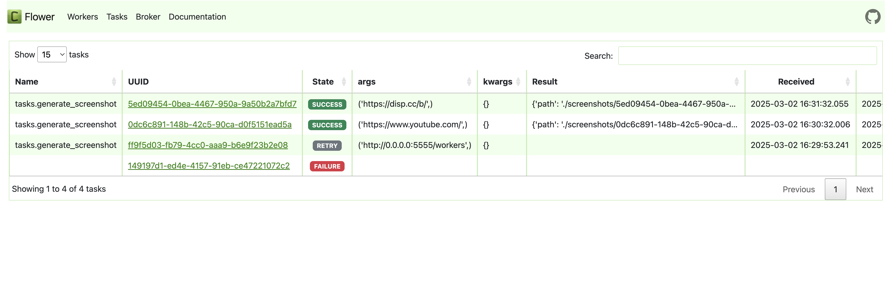

# CeleryShot - Screenshot Service with Flask & Celery

## 專案介紹
**CeleryShot** 是一個簡單的「網頁截圖背景服務」，使用 Flask 提供 API，並透過 Celery + Redis 進行非同步截圖處理。這套架構可讓你熟悉：

- Flask REST API
- Celery 工作排程與背景執行
- Redis 佇列管理
- Flower 任務監控
- Docker Compose 服務整合


## 網站範例
網站首頁


任務查看


---

## 目錄結構
```
CeleryShot/
├── docker-compose.yml      # 整體服務編排
├── app/                     # 主程式碼
│   ├── app.py                # Flask API
│   ├── celery_app.py         # Celery初始化
│   ├── tasks.py               # 截圖邏輯
│   ├── requirements.txt       # 依賴清單
│   └── screenshots/           # 截圖圖片存放
├── flask/
│   └── Dockerfile              # Flask Dockerfile
├── celery/
│   └── Dockerfile              # Celery Worker Dockerfile
```

---

## 環境與工具
| 服務 | 說明 |
|---|---|
| Flask API | 提供上傳網址與查詢截圖狀態的 API |
| Celery Worker | 背景工作，負責開瀏覽器截圖 |
| Redis | Celery Broker（負責任務排隊） |
| Flower | Celery 監控儀表板 |
| Docker Compose | 管理整體服務編排 |

---

## 安裝與執行
### 1. 啟動服務
```bash
docker compose up --build
```

---

## API 使用方式
### 1. 上傳網址，產生截圖
```bash
curl -X POST http://localhost:6000/screenshot \
    -H "Content-Type: application/json" \
    -d '{"url": "https://example.com"}'
```
回傳範例：
```json
{"task_id": "some-task-id"}
```

### 2. 查詢截圖任務狀態
```bash
curl http://localhost:6000/task/some-task-id/status
```
可能狀態：
```json
{"status": "PENDING"}
{"status": "SUCCESS", "download_url": "/screenshot/some-task-id.png"}
```

### 3. 下載截圖
```bash
curl http://localhost:6000/screenshot/some-task-id.png --output screenshot.png
```

---

## Flower 監控
打開瀏覽器，連到：
```
http://localhost:5555
```
你可以看到：
- 任務排隊、執行狀況
- Worker 狀態
- 失敗任務重試
- 任務歷史紀錄

---

## 設定環境變數（可選）
| 變數名稱 | 預設值 |
|---|---|
| CELERY_BROKER_URL | redis://redis:6379/0 |
| CELERY_RESULT_BACKEND | redis://redis:6379/0 |

---

## 技術重點
- Flask REST API 設計
- Celery 非同步任務設計
- Celery Worker/Beat分離架構
- Docker Compose 服務管理
- Flower 監控與問題排查

---

## 延伸學習
- 加入 Celery Beat 支援定時排程
- 把截圖圖片上傳到 S3/GCS
- 增加 Grafana+Prometheus 監控
- 增加 Logging與Error Handling

---

## License
MIT License. 歡迎自由使用與修改。

---

## Maintainer
**Hsiang**  
如果有問題，歡迎交流討論！

